# SƠ ĐỒ KIẾN TRÚC HỆ THỐNG VIBRAGUARD AI

## 1. Kiến trúc Tổng quan (Full-Stack IoT)

```mermaid
graph TB
    subgraph "EDGE LAYER - ESP32-C3"
        MPU[MPU-6050<br/>Accelerometer<br/>50Hz, 6-axis]
        ESP[ESP32-C3 Super Mini<br/>RISC-V, WiFi, I2C]
        AI[Edge Impulse AI<br/>95.1% accuracy<br/>1ms inference<br/>1.4KB RAM]
        BUZZER[Buzzer<br/>via NPN S8050<br/>GP1]

        MPU -->|I2C<br/>GP8/GP9| ESP
        ESP --> AI
        AI -->|Attack<br/>Detected| BUZZER
    end

    subgraph "PROTOCOL LAYER"
        WIFI[WiFi 2.4GHz<br/>Auto-reconnect]
        MQTT_EDGE[MQTT Client<br/>PubSubClient]

        ESP --> WIFI
        ESP --> MQTT_EDGE
    end

    subgraph "CLOUD LAYER - GCP (34.87.133.103)"
        subgraph "Docker Compose"
            MOSQUITTO[Eclipse Mosquitto<br/>MQTT Broker<br/>Port 1883]
            BACKEND[Spring Boot 3.1.5<br/>Java 17<br/>Port 8080]
            POSTGRES[PostgreSQL 14<br/>Database<br/>Port 5432]
        end

        GCP_VM[GCE e2-small<br/>asia-southeast1-b<br/>Static IP]
        FIREWALL[Firewall Rules<br/>22, 1883, 8080, 5432]

        GCP_VM --> FIREWALL
        FIREWALL --> MOSQUITTO
        FIREWALL --> BACKEND
        FIREWALL --> POSTGRES
    end

    subgraph "ALERT CHANNELS"
        WS[WebSocket<br/>STOMP Protocol<br/>/topic/alerts]
        TWILIO[Twilio API<br/>SDK 10.6.5]
        SMS[SMS Alert<br/>+84399354603]
        VOICE[Voice Call<br/>TwiML Bins]

        BACKEND --> WS
        BACKEND --> TWILIO
        TWILIO --> SMS
        TWILIO --> VOICE
    end

    subgraph "FRONTEND LAYER"
        WEB[React + Vite<br/>Web Dashboard<br/>localhost:5174]
        MOBILE[Flutter 3.9.2<br/>Android App<br/>Emulator]

        WEB --> |WebSocket| WS
        WEB --> |REST API| BACKEND
        MOBILE --> |REST API| BACKEND
    end

    MQTT_EDGE -->|Topic:<br/>vibra_guard/sensor| MOSQUITTO
    MOSQUITTO -->|Subscribe| BACKEND
    BACKEND -->|Publish:<br/>vibra_guard/control/{id}| MOSQUITTO
    MOSQUITTO -->|Control<br/>Commands| MQTT_EDGE
    BACKEND --> POSTGRES

    style ESP fill:#e1f5ff
    style AI fill:#fff9c4
    style BACKEND fill:#c8e6c9
    style MOSQUITTO fill:#ffccbc
    style POSTGRES fill:#d1c4e9
    style TWILIO fill:#f8bbd0
    style WEB fill:#b2dfdb
    style MOBILE fill:#b2dfdb
```

---

## 2. Data Flow - Attack Detection Sequence

```mermaid
sequenceDiagram
    participant MPU as MPU-6050<br/>Sensor
    participant ESP as ESP32-C3
    participant AI as Edge AI<br/>Engine
    participant BUZ as Buzzer
    participant MQTT as Mosquitto<br/>Broker
    participant BE as Spring Boot<br/>Backend
    participant DB as PostgreSQL<br/>Database
    participant WS as WebSocket<br/>Clients
    participant TWI as Twilio<br/>API
    participant USER as User<br/>(Phone/Web)

    Note over MPU,ESP: 1. EDGE PROCESSING
    MPU->>ESP: Vibration data<br/>(50Hz, 3-axis)
    ESP->>AI: Raw sensor buffer<br/>(2000ms window)
    AI->>AI: Spectral Analysis<br/>+ Classification
    AI->>ESP: Predictions:<br/>Attack: 93%<br/>Normal: 5%<br/>Noise: 2%

    alt Attack >= 80% AND System ARMED
        Note over ESP,BUZ: 2. LOCAL ALERT
        ESP->>BUZ: 🚨 Activate Buzzer
        BUZ->>USER: Continuous alarm

        Note over ESP,MQTT: 3. CLOUD NOTIFICATION
        ESP->>MQTT: PUBLISH<br/>Topic: vibra_guard/sensor<br/>Payload: {<br/>  deviceId: "ESP32_CUA_SO_01",<br/>  aiTriggered: true,<br/>  confidence: 0.93,<br/>  scores: {...}<br/>}

        MQTT->>BE: Forward message

        Note over BE,DB: 4. BACKEND PROCESSING
        BE->>BE: Parse JSON DTO
        BE->>BE: Validate attack<br/>(confidence >= 80%)
        BE->>DB: INSERT event<br/>(device_id, timestamp, scores)

        Note over BE,TWI: 5. MULTI-CHANNEL ALERTS
        par Parallel Alerts
            BE->>WS: Broadcast to<br/>/topic/alerts
            WS->>USER: Real-time<br/>notification
        and
            BE->>TWI: sendSMS()<br/>to +84399354603
            TWI->>USER: 📱 SMS:<br/>"🚨 ATTACK DETECTED!"
        and
            BE->>TWI: makeCall()<br/>to +84399354603
            TWI->>USER: ☎️ Voice call<br/>with TwiML message
        end
    end

    Note over USER,ESP: 6. REMOTE CONTROL
    USER->>BE: POST /api/control/disarm<br/>{deviceId: "ESP32_CUA_SO_01"}
    BE->>MQTT: PUBLISH<br/>Topic: vibra_guard/control/ESP32_CUA_SO_01<br/>Payload: {"command":"DISARM"}
    MQTT->>ESP: Forward command
    ESP->>BUZ: 🔕 Deactivate Buzzer
    ESP->>USER: Alarm stopped
```



---

## 3. Sơ đồ Nối dây Phần cứng


---

## 4. Database Schema

```mermaid
erDiagram
    DEVICES ||--o{ VIBRATION_EVENTS : has

    DEVICES {
        bigint id PK
        varchar device_id UK "ESP32_CUA_SO_01"
        varchar device_name "Cửa sổ phòng ngủ"
        varchar location "Tầng 1"
        varchar status "ACTIVE/INACTIVE"
        timestamp created_at
        timestamp updated_at
    }

    VIBRATION_EVENTS {
        bigint id PK
        bigint device_id FK
        integer sensor_value "0-100"
        timestamp event_timestamp
        varchar severity "WARNING/CRITICAL"
        text notes "AI Attack Detected - Confidence: 95.1%"
    }
```



---

## 5. Docker Compose Architecture


---

## 6. AI Pipeline (Edge Impulse)


---

## 7. API Endpoints

```mermaid
graph TB
    subgraph "REST API - Spring Boot"
        API1[GET /api/control/status<br/>Response: {devicesCount, systemStatus}]
        API2[POST /api/control/arm<br/>Body: {deviceId}]
        API3[POST /api/control/disarm<br/>Body: {deviceId}]
        API4[POST /api/control/panic<br/>Body: {deviceId}]
        API5[GET /api/events<br/>Query: ?deviceId, ?limit]
        API6[GET /api/devices<br/>Response: List of devices]
    end

    subgraph "WebSocket - STOMP"
        WS1[CONNECT /ws<br/>Handshake: SockJS]
        WS2[SUBSCRIBE /topic/alerts<br/>Receive: Attack events]
    end

    subgraph "MQTT Topics"
        MQTT1[PUBLISH vibra_guard/sensor<br/>From: ESP32<br/>Payload: SensorDataDTO]
        MQTT2[SUBSCRIBE vibra_guard/control/{deviceId}<br/>To: ESP32<br/>Payload: ControlCommandDTO]
    end

    style API1 fill:#b2dfdb
    style API2 fill:#ffccbc
    style API3 fill:#c8e6c9
    style API4 fill:#f8bbd0
    style WS2 fill:#fff9c4
    style MQTT1 fill:#d1c4e9
```

---

## 8. Deployment Flow (GCP)


---

## Chú thích Kỹ thuật

### Edge Layer

- **ESP32-C3 Super Mini**: RISC-V 32-bit, 160MHz, 400KB SRAM, WiFi 802.11 b/g/n
- **MPU-6050**: ±2g accelerometer, 16-bit ADC, I2C 400KHz
- **Sampling Rate**: 50Hz (đã fix từ 10Hz ban đầu)
- **AI Inference**: 1ms/prediction, 1.4KB RAM, 45.1KB Flash

### Protocol Layer

- **MQTT QoS**: 0 (At most once) - Optimize for speed
- **WiFi Security**: WPA2-PSK
- **Auto-reconnect**: WiFi (10s interval), MQTT (5s interval)

### Cloud Layer

- **GCE Instance**: e2-small (2 vCPUs, 2GB RAM, asia-southeast1-b)
- **OS**: Container-Optimized OS (COS) hoặc Ubuntu 20.04
- **Static IP**: 34.87.133.103 (Region: asia-southeast1)
- **Docker**: Version 24.x, Compose V2

### Database

- **PostgreSQL**: 14-alpine, Connection Pool (HikariCP)
- **JPA/Hibernate**: Auto DDL (update mode)
- **Volume**: Persistent storage cho postgres_data

### Security

- **Firewall**: Ingress rules (0.0.0.0/0 cho demo, nên giới hạn IP production)
- **Twilio**: API Key & Auth Token trong application.properties
- **Database**: Password-protected (vibraguard_pass)

---

**Ghi chú:** Sơ đồ này phản ánh đúng 100% hệ thống thực tế đã triển khai và kiểm thử thành công vào ngày 31/10/2025.
